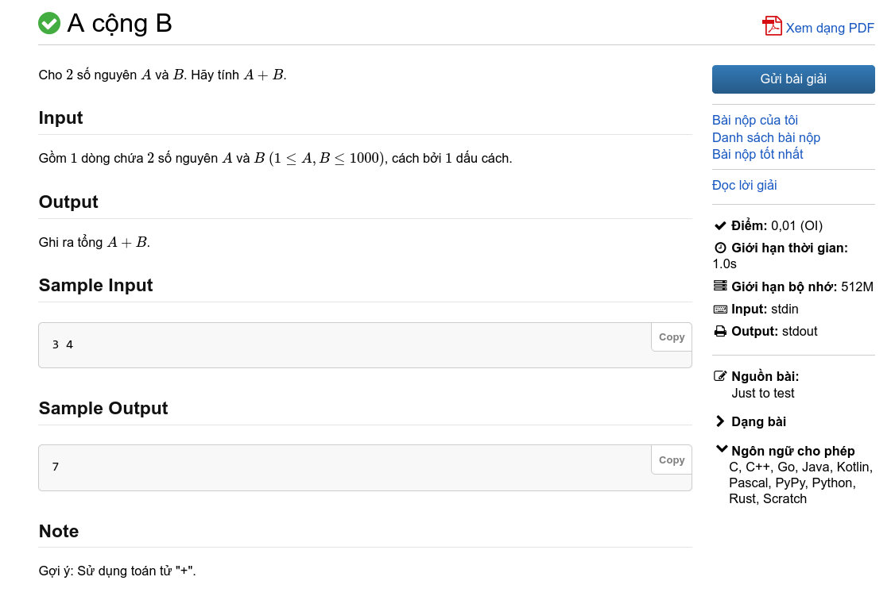

# Giới thiệu về lập trình thi đấu
!!!
Rất cảm ơn **SmolLemon**, một thành viên của ChuyentinORZ, đã contribute cho ChuyentinORZ Wiki! Các bạn có thể xem repo gốc [tại đây](https://github.com/SmolLemon/SmolBook). SmolBook is licensed under [!badge CC-BY-SA 4.0](https://github.com/SmolLemon/SmolBook?tab=CC-BY-SA-4.0-1-ov-file)
!!!
**Lập trình thi đấu**, tên tiếng anh là **competitive programming**, về cơ bản là một *bộ môn thể thao*, nơi thí sinh viết nên các chương trình máy tính để giải quyết các bài toán.

## Tổng quan

Việc giải một bài toán về lập trình thi đấu sẽ bao gồm 2 bước chính: **Thiết kế thuật toán** và **cài đặt thuật toán**.

Việc **thiết kế thuật toán** sẽ yêu cầu ta thiết kế một thuật toán phù hợp để giải quyết bài toán. Nó yêu cầu ta phải có kĩ năng tư duy giải quyết vấn đề và cả tư duy toán học. Thuật toán cần phải nhanh và hiệu quả để có thể giải quyết được bài toán.

Thông thường, các bài toán thường sẽ liên quan đến những chủ đề khác nhau: tổ hợp, lí thuyết số, lí thuyết đồ thị, lí thuyết trò chơi, xử lí xâu, cấu trúc dữ liệu,... và việc áp dụng những kiến thức này cộng thêm với các hướng giải quyết mới sẽ giúp ta thiết kế được một thuật toán hiệu quả.

Việc **cài đặt thuật toán** là quá trình thực hiện hóa thuật toán mà ta đã nghĩ ra. Sự hiểu biết về ngôn ngữ lập trình và cách áp dụng nó vào việc cài đặt thuật toán mà một yêu cầu hết sức quan trọng trong quá trình giải quyết bài toán.	 

Các chương trình cần được viết một cách ngắn gọn và xúc tích (một chương trình dài nhất cũng chỉ tầm vài trăm dòng) bởi trong các cuộc thi lập trình, thời gian là có hạn. Đồng thời, các chương trình cũng phải thỏa mãn những giới hạn mà bài toán đề ra về thời gian thực thi chương trình và giới hạn bộ nhớ mà chương trình được phép sử dụng.

### Một chương trình điển hình

Một chương trình máy tính được viết ra bởi thí sinh để giải một bài toán cụ thể sẽ lấy dữ liệu nhập (**input**) và xuất dữ liệu (**output**) chứa đáp án đúng tương ứng. 

Ta ví dụ với bài toán [**A cộng B**](https://oj.vnoi.info/problem/post):

Bài toán cho ta **2 số A và B** và yêu cầu ta tính tổng của hai số ấy. Dữ liệu nhập sẽ là **2 số A và B trên một dòng** dòng và yêu cầu ta in ra tổng hai số.

Khi ta nộp chương trình, máy chấm sẽ chạy chương trình với một danh sách các dữ liệu nhập (testcase) và kiểm tra đáp án mà chương trình in ra với đáp án của mỗi testcase tương ứng. Với mỗi testcase, máy chấm sẽ trả về cho ta một trong các kết quả sau đây:

|Kết quả|Ý nghĩa|
|---|---|
|Accepted (AC)| Chương trình in kết quả đúng và thỏa mãn các yêu cầu của bài.|
|Wrong Answer (WA)| Chương trình cho ra kết quả sai.|
|Compilation Error (CE)| Chương trình bị lỗi biên dịch.|
|Runtime Error (RTE)| Chương trình gặp lỗi khi chạy.|
|Output Limit Exceeded (OLE)| Chương trình in ra quá nhiều dữ liệu. |
|Memory Limit Exceeded (MLE)| Chương trình sử dụng bộ nhớ nhiều hơn quy định.|
|Time Limit Exceeded (TLE)| Chương trình chạy quá thời gian quy định.|
|Internal Error (IE)| Lỗi đến từ hệ thống máy chấm.|

Tùy theo *thể thức* mà điểm cho mỗi bài sẽ khác nhau. Có thể thức sẽ tính điểm theo `số lượng testcase AC/số lượng testcase`, có thể thức chỉ cho điểm khi ta AC toàn bộ các testcase. 

#### Subtask

Một số bài toán sẽ chia các testcase theo các nhóm khác nhau, giúp thí sinh giành được một phần điểm số cho bài toán. Các nhóm testcase này được gọi là subtask. Các subtask thường sẽ chứa những testcase có giới hạn nhỏ hơn giới hạn bài toán, hoặc có một số tính chất đặc biệt nào đó, hoặc cả hai.

## Vì sao cần lập trình thi đấu?

Việc giải các bài toán và tham gia các cuộc thi lập trình thi đấu có thể giúp các thí sinh có hứng thú với các ngành liên quan đến khoa học máy tính. Những kiến thức học được từ lập trình thi đấu cũng cải thiện khả năng lập trình và tư duy logic của các lập trình viên, giúp họ có lợi thế trong công việc.

## Các cuộc thi lập trình

Có vô số cuộc thi lập trình phổ biến trên toàn quốc và quốc tế. Ta cùng điểm qua một số cuộc thi tiêu biểu.

### Kì thi Học sinh giỏi cấp trường/thành phố/tỉnh (môn Tin học)

Mục đích của các cuộc thi này nhằm động viên, khuyến khích học sinh và giáo viên phát huy và nâng cao năng lực của bản thân, đồng thời phát hiện và bồi dưỡng những học sinh có năng khiếu ở các môn học.

### Kỳ thi Olympic truyền thống 30/4 (môn Tin học)

**Cuộc thi Olympic truyền thống 30/4** là một cuộc thi học sinh giỏi hàng năm dành cho học sinh khối 10 và 11 của khu vực phía Nam. Cuộc thi này do trường THPT Chuyên Lê Hồng Phong TPHCM sáng lập và được tổ chức lần đầu tiên vào năm 1995 với mục đích phát hiện, bồi dưỡng những học sinh có năng khiếu thuộc các khối lớp 10 và 11, chuẩn bị đội ngũ cho kỳ thi học sinh giỏi quốc gia, tạo điều kiện cho việc giao lưu học hỏi giữa các học sinh giỏi và trao đổi chuyên môn giữa các thầy cô dạy lớp chuyên của các tỉnh phía Nam[^1].

### Kỳ thi chọn Học sinh sinh giỏi khu vực Duyên Hải và đồng bằng Bắc Bộ (môn Tin học)

Kỳ thi do Hội các trường THPT chuyên khu vực duyên hải và đồng bằng Bắc Bộ tổ chức hằng năm. 
Kỳ thi là dịp phát hiện học sinh giỏi, học sinh xuất sắc các bộ môn để các trường THPT chuyên có kế hoạch lựa chọn, bồi dưỡng các em tham gia các kỳ thi học sinh giỏi quốc gia, khu vực và quốc tế. Đồng thời là dịp để đội ngũ cán bộ quản lý và giáo viên các trường THPT chuyên trao đổi, chia sẻ kinh nghiệm, nâng cao trình độ chuyên môn bồi dưỡng môn chuyên và học sinh giỏi[^2].

### Kì thi chọn Học sinh giỏi Quốc gia (môn Tin học)

**Kỳ thi chọn học sinh giỏi quốc gia trung học phổ thông** (viết tắt là Kỳ thi HSGQG) là kỳ thi chọn học sinh giỏi cấp quốc gia dành cho học sinh bậc trung học phổ thông do Bộ Giáo dục và Đào tạo tổ chức vào khoảng từ tháng 12 đến tháng 1 hằng năm. Những học sinh đạt điểm cao nhất trong kỳ thi này ở một vài bộ môn được Bộ Giáo dục và Đào tạo triệu tập tại Hà Nội, Việt Nam để tham gia kỳ thi chọn các học sinh vào đội tuyển Quốc gia Việt Nam tham dự các cuộc thi Olympic khu vực và quốc tế[^3].

Ở bộ môn tin học, cuộc thi có tên gọi không chính thức là **VOI - Vietnamese Olympiad in Informatics**.

### Hội thi Tin học trẻ các cấp

**Hội thi Tin học trẻ** là kì thi tin học thường niên dành cho các học sinh các cấp. Đây là sân chơi uy tín trong lĩnh vực tin học, do Trung ương Đoàn, Bộ Khoa học và Công nghệ, Bộ Giáo dục và Đào tạo, Bộ Thông tin và Truyền thông và Hội Tin học Việt Nam phối hợp tổ chức thường niên từ năm 1995.

### Olympic Tin học Quốc tế (IOI)

**Olympic Tin học Quốc tế** (**International Olympiad in Informatics - IOI**) là một cuộc thi quốc tế lập trình thi đấu thường niên dành cho học sinh trung học (cấp 2 và 3). Cuộc thi đầu tiên được tổ chức vào năm 1989 tại Bulgaria.

### ICPC

**International Collegiate Programming Contest**, hay **ICPC**, là một cuộc thi lập trình dành cho sinh viên. Đây là cuộc thi lập trình lâu đời nhất, lớn nhất và danh tiếng nhất thế giới. Hằng năm, cuộc thi thu hút hơn 50000 thí sinh từ hơn 3000 trường đại học khác nhau trên toàn thế giới. [^4]

Mặc dù cuộc thi chỉ giới hạn cho các trường đại học, ở Việt Nam, ban tổ chức ICPC Việt Nam cũng tổ chức Kì thi ICPC cho các bạn học sinh THPT trên khắp cả nước.

### Các cuộc thi online

Ngoài các cuộc thi lập trình thi đấu trực tiếp, nhiều trang web được tạo ra nhằm hỗ trợ và cung cấp nhiều điều bổ ích cho các thí sinh trên toàn thế giới. Các trang như [VNOJ](https://oj.vnoi.info/), [Codeforces](https://codeforces.com/), [Atcoder](https://atcoder.jp/),... là một trong những ví dụ điển hình. Các trang này tổ chức các cuộc thi online, có nhiều dạng bài phong phú, một số trang còn hỗ trợ tìm kiếm việc làm liên quan đến lập trình!

---

[!ref icon="link" text="Kì thi Olympic 30/4 lần thứ XXVI năm 2021"](http://www.thpt-lehongphong-tphcm.edu.vn/vi/content/ky-thi-olympic-truyen-thong-304-lan-thu-xxvi-nam-2021)

[!ref icon="link" text="Gần 2.000 học sinh khu vực duyên hải và đồng bằng Bắc Bộ thi chọn học sinh giỏi tại TP Hải Dương"](https://baohaiduong.vn/gan-2-000-hoc-sinh-khu-vuc-duyen-hai-va-dong-bang-bac-bo-thi-chon-hoc-sinh-gioi-tai-tp-hai-duong-387551.html)

[!ref icon="link" text="Kỳ thi chọn HSG Quốc Gia THPT"](https://vi.wikipedia.org/wiki/Kỳ_thi_chọn_học_sinh_giỏi_quốc_gia_trung_học_phổ_thông)